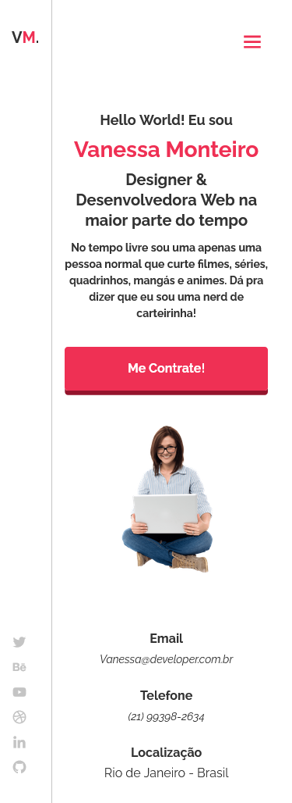
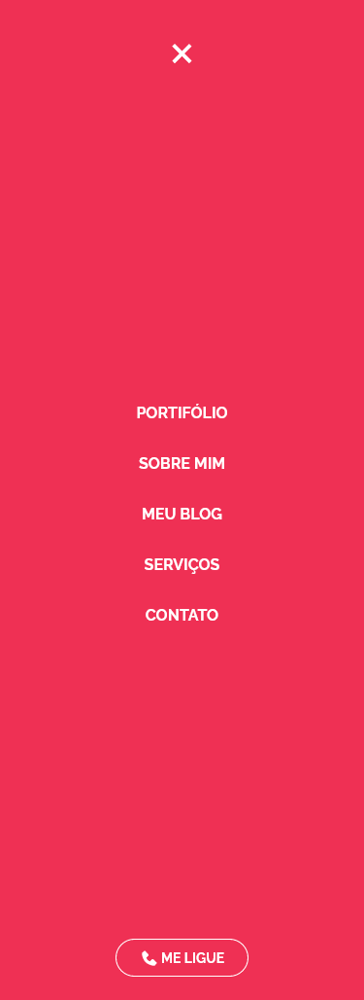
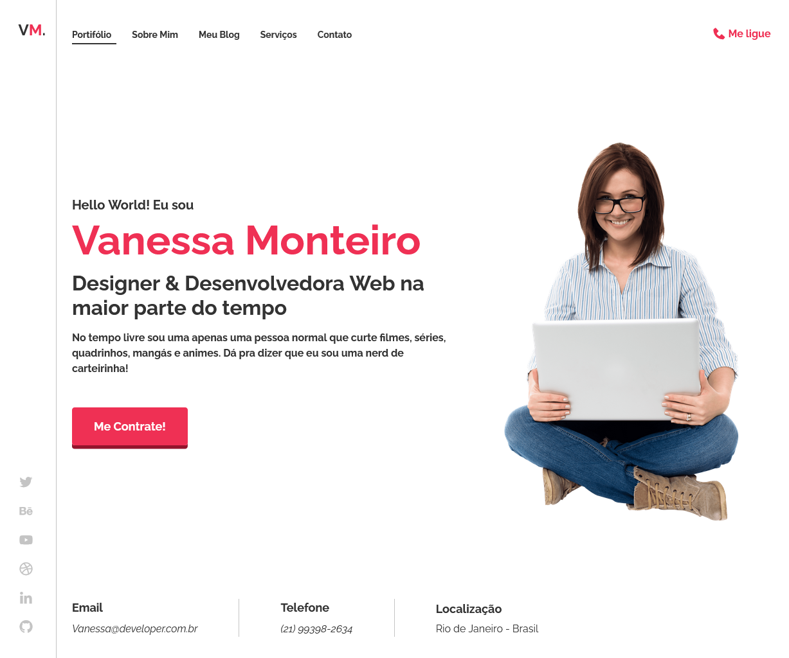

# **Modelo de Portfólio**

## **Sobre o projeto** 🚀
Este projeto foi criado com o intuito de colocar em prática os conhecimentos adquiridos em HTML, CSS, JS e SASS.

O objetivo deste projeto é a criação de um modelo de portfólio fictício usando tecnologias simples como **HTML5** **CSS3**, **JavaScript** e **SASS**, além de abranger os conceitos de: como estruturar layouts responsivos, uso de variáveis, mixins e aninhamento no SASS, além do uso de Flexbox e Grid Layout.

## **Tecnologias utilizadas** 🧰
* HTML
* CSS
* JavaScript
* [SASS](https://sass-lang.com/)
* [Google Fonts](https://fonts.google.com/)
* [Boxicons](https://boxicons.com/)

## **Layout do projeto**

### **Versão Mobile** 📱

### **Versão Mobile - Menu** 📱

### **Versão Desktop** 💻
 

## **Autor** 🧑‍🚀
Igor Melo

Email:

[igor.m.mesquita@outlook.com.br](igor.m.mesquita@outlook.com.br)

Linkedin:

[https://www.linkedin.com/in/igor-melo-bb913a219/](https://www.linkedin.com/in/igor-melo-bb913a219/)